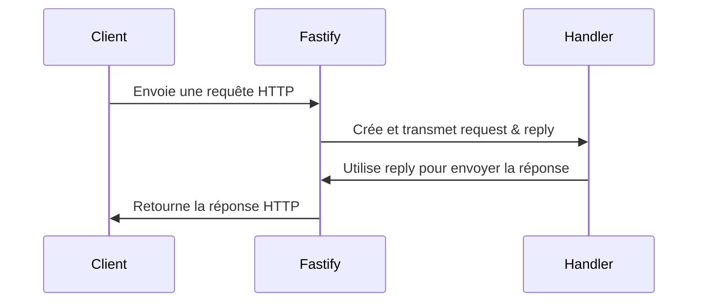

# Fastify : Request et Reply

## Introduction
Dans Fastify, chaque handler de route reçoit deux objets principaux : `request` et `reply`. Ils sont essentiels pour traiter les requêtes HTTP et construire les réponses envoyées au client.

---

## 1. L'objet `request`
L'objet `request` représente la requête HTTP reçue par le serveur. Il contient toutes les informations envoyées par le client.

### Principales propriétés :
- **request.body** : Le corps de la requête (pour POST, PATCH, etc.)
- **request.params** : Les paramètres d'URL (ex : `/users/:id` → `request.params.id`)
- **request.query** : Les paramètres de la query string (ex : `/users?page=2` → `request.query.page`)
- **request.headers** : Les headers HTTP envoyés par le client
- **request.method** : La méthode HTTP (GET, POST, etc.)
- **request.url** : L’URL complète de la requête

### Exemple :
```typescript
server.post('/users/:id', async (request, reply) => {
  const id = request.params.id;
  const username = request.body.username;
  // ...
});
```

---

## 2. L'objet `reply`
L'objet `reply` permet de construire et d'envoyer la réponse HTTP au client.

### Principales méthodes :
- **reply.status(code)** : Définit le code HTTP de la réponse (ex : 200, 404)
- **reply.send(data)** : Envoie la réponse au client (souvent un objet JSON)
- **reply.header(name, value)** : Ajoute un header HTTP à la réponse

### Exemple :
```typescript
server.get('/users/:id', async (request, reply) => {
  const user = await getUserById(request.params.id);
  if (!user) {
    return reply.status(404).send({ error: 'User not found' });
  }
  return reply.send({ success: true, data: user });
});
```

---

## 3. Gestion par Fastify
- Fastify crée automatiquement un nouvel objet `request` et `reply` pour chaque requête entrante.
- Ces objets sont injectés dans chaque handler de route.
- Cela permet d’isoler chaque requête et d’éviter les effets de bord entre utilisateurs.

---

## 4. Schéma récapitulatif


---

## 5. Conclusion
`request` et `reply` sont au cœur du fonctionnement de Fastify. Ils permettent de manipuler facilement les données de la requête et de construire des réponses adaptées, tout en assurant la sécurité et l’isolation des traitements.
